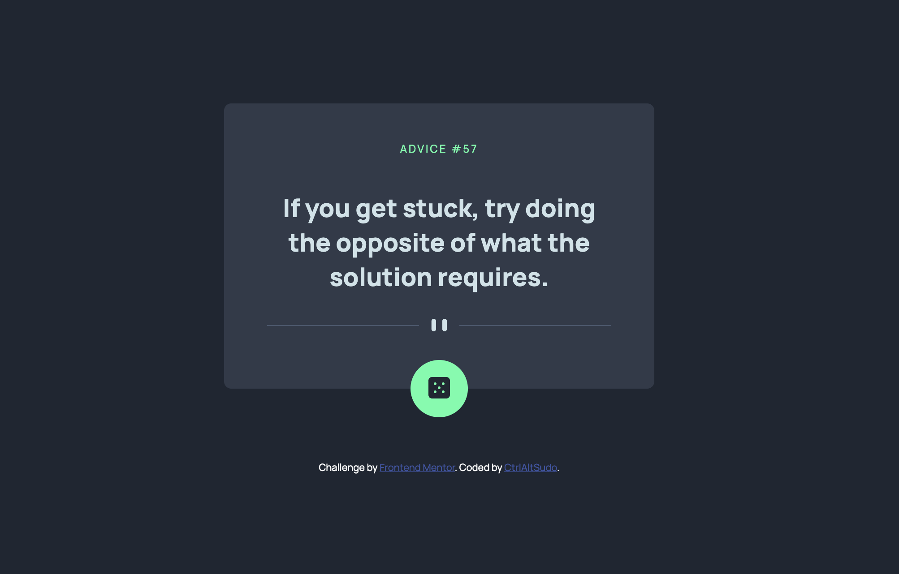

<h1 align="center">Advice generator app</h1>

 <a align="center" href="https://ctrlaltsudo.github.io/Advice-generator-app/">Live Demo</a>

 <a align="center" href="https://www.frontendmentor.io/solutions/advicegeneratorapp-QHL975sL6V">Solution Page</a>

<h2 align="center">Project Screenshot<h2>

  </img>

## Description

This is a Frontend Mentor challenge, click the link above to visit the challenge page. 

## Built with 

HTML

CSS

Flexbox

Advice Api

## What I learnt 
This is my first time submitting a challenge with an API, it took me ages to figure out how to stop Firefox from caching the data from the advice API, next time I'll try using Axios.

## Authors

<a href="https://github.com/CtrlAltSudo">CtrlAltSudo</a>.

## Acknowledgments 

Colt's web developer Udemy course is an invaluable resourse! 